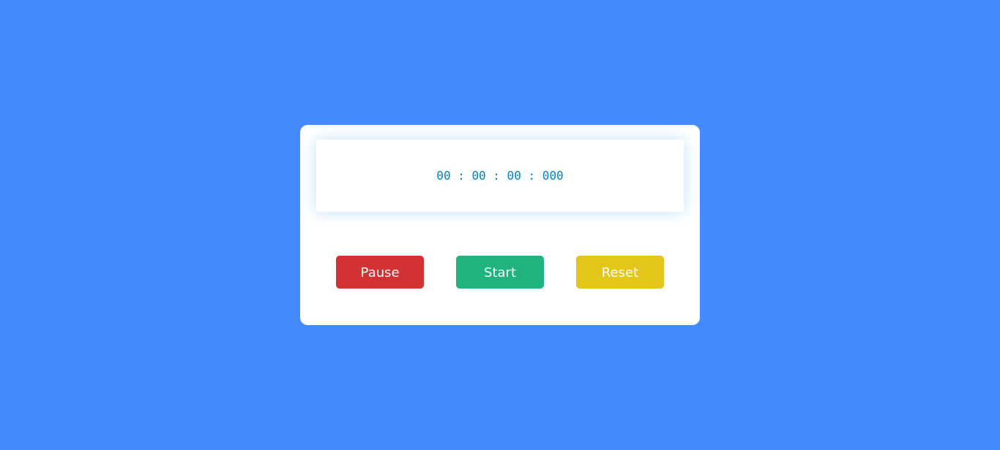

# MAKING STOP WATCH TIMER WITH JAVASCRIPT

## Table of contents

- Overview: 
    Making Stop Watch with JavaScript ;

- The-challenge:
    To solve that how should increase number and what method or function should i use was challenge and after some researching i found some code resources to solve my problem.

- Screenshot:
    

- Builtwith:
    Html, Css, JavaScript
  
- What-I-learned:
    How should i make stopwatch how should i use setinterval() and describe it, and should i use and describe it clearinterval.

- Author:
    Mohammad Reza Dargi

### Continued development

-In next project i will make Pomodoro clock with Html, Css, JavaScript.

## Author

- Name & Family name: Mohammad Reza Dargi
- Github: mr-dargi

